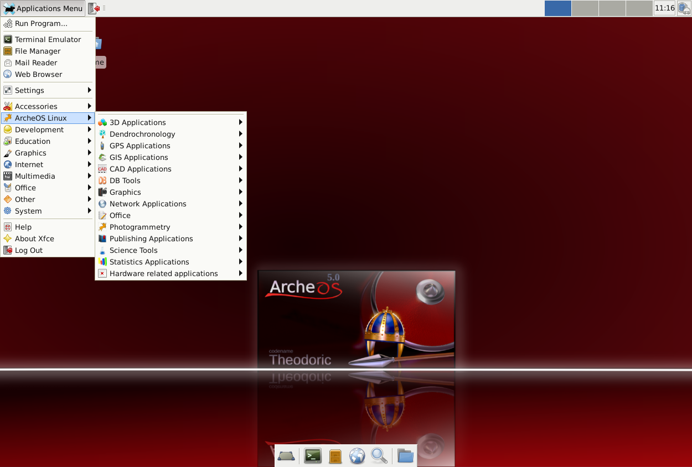

Welcome to ArcheOS!
===================

What is ArcheOS?
----------------

**ArcheOS** is the acronym of Archeological Operating System. It is a **GNU/Linux** live distribution built for archaeological aims. 
At the moment a new version (5.0 codename "**Theodoric**") based on Debian “Wheezy” is under development.
To run ArcheOS, you have to burn a DVD with the .iso image and put it inside your DVD reader. Then restart the computer. 
It is also possible to install ArcheOS on your harddisk (click on the install ArcheOS icon).
ArcheOS is developed following the **OpArc project** guidelines and it is released by `Arc-Team s.n.c`_. under the General Public License (GPL).

Download and install
--------------------

Please see the :ref:`download-latest-version` to download ArcheOS!

Found an issue?
---------------

If you found an issue on ArcheOS please open a bug at our `issue page`_ on **GitHub**

News
----

* We are actively working on **ArcheOS 5 "Theodoric"**. If you are interested and you think you want to help (any help is appreciated!) you can :ref:`contact-us`!

.. _contact-us:

Contact us
----------

If you have some questions or suggestions, or if you want to contact us, just do it! 

Mailing list
^^^^^^^^^^^^

A mailing list (in Italian language) is active for who wanto to collaborate/discuss/keep informed about ArcheOS. 
To subscribe just go to http://lists.linux.it/listinfo/archeos and follow the instructions.

An english language mailing list is for developers: check this page if you are interested: http://lists.linux.it/listinfo/archeos-dev

IRC Channel
^^^^^^^^^^^

You can find us on `FreeNode`_ on chan **#archeos**

If you are not familiar with IRC and Freenode, here's a `little introduction`_.

If you are a newbie with IRC clients, we suggest you to use `XChat`_. You can also use the `FreeNode webchat service`_, although this is not suggested...

Email addresses
^^^^^^^^^^^^^^^

Have you something to say that cannot be told in ML? Write to us directly!

* Alessandro Bezzi: alessandro.bezzi[~at~]arc-team.com
* Luca Bezzi: luca.bezzi[~at~]arc-team.com
* Fabrizio Furnari: fab.furnari[~at~]gmail.com
* Denis Francisci: denis.francisci[~at~]gmail.com
* Rupert Gietl: ruppi[~at~]arc-team.com
* Giuseppe Naponiello: beppenapo[~at~]gmail.com

Friends
^^^^^^^ 

Here's a list of helper/collaborators/friends that help us keeping ArcheOS a great distribution!

* `Myosotis`_
* `Open Source Geospatial Foundation`_
* `Open Source Photogrammetry blog`_
* `LayerJet Solutions`_

.. _Arc-Team s.n.c: http://www.arc-team.com/
.. _issue page: https://github.com/archeos/ArcheOS/issues
.. _FreeNode: https://freenode.net/
.. _little introduction: http://www.irchelp.org/irchelp/irctutorial.html
.. _XChat: http://xchat.org/
.. _FreeNode webchat service: http://webchat.freenode.net/
.. _Myosotis: http://myosotis.tuxfamily.org/
.. _Open Source Geospatial Foundation: http://www.osgeo.org/
.. _Open Source Photogrammetry blog: http://opensourcephotogrammetry.blogspot.com/
.. _LayerJet Solutions: http://www.layerjet.com/
